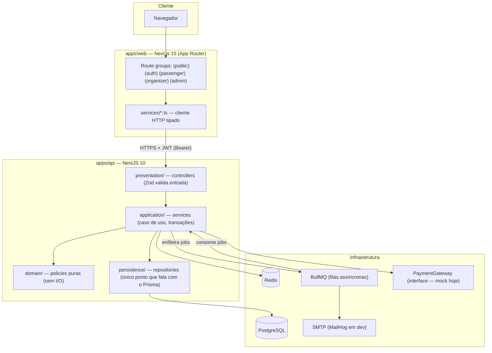
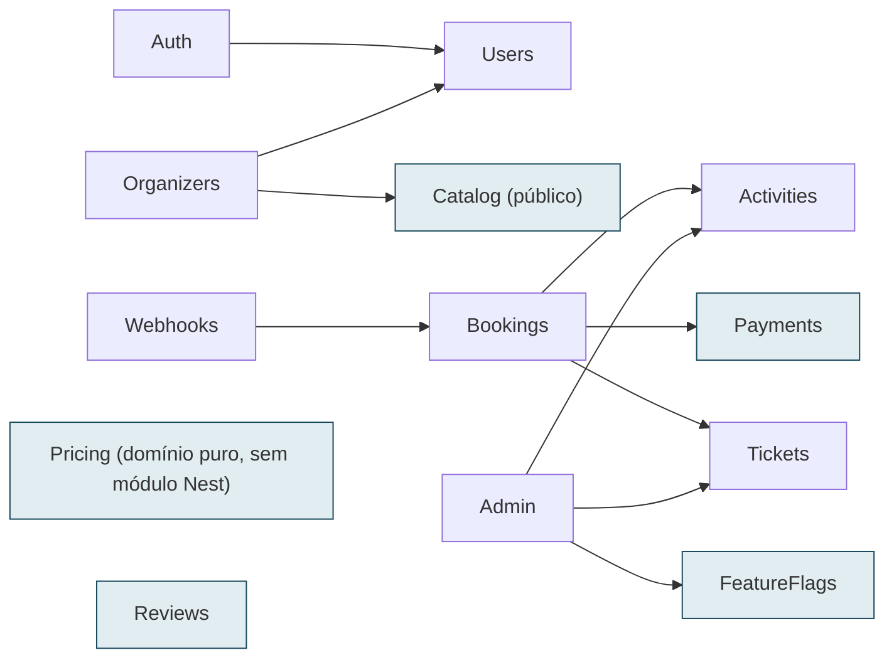
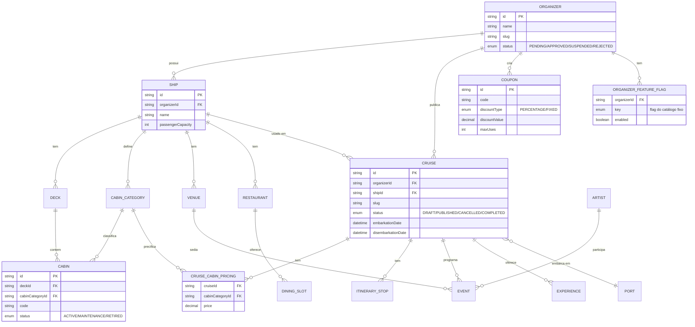
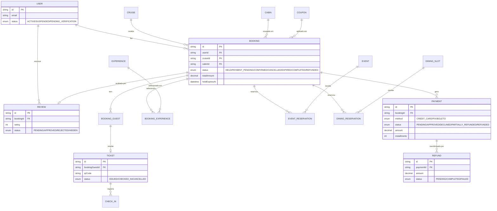
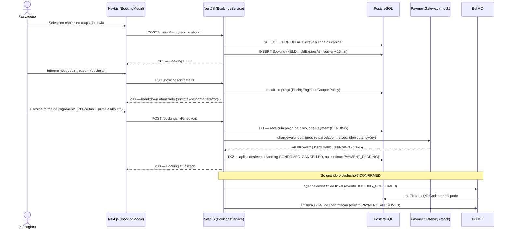
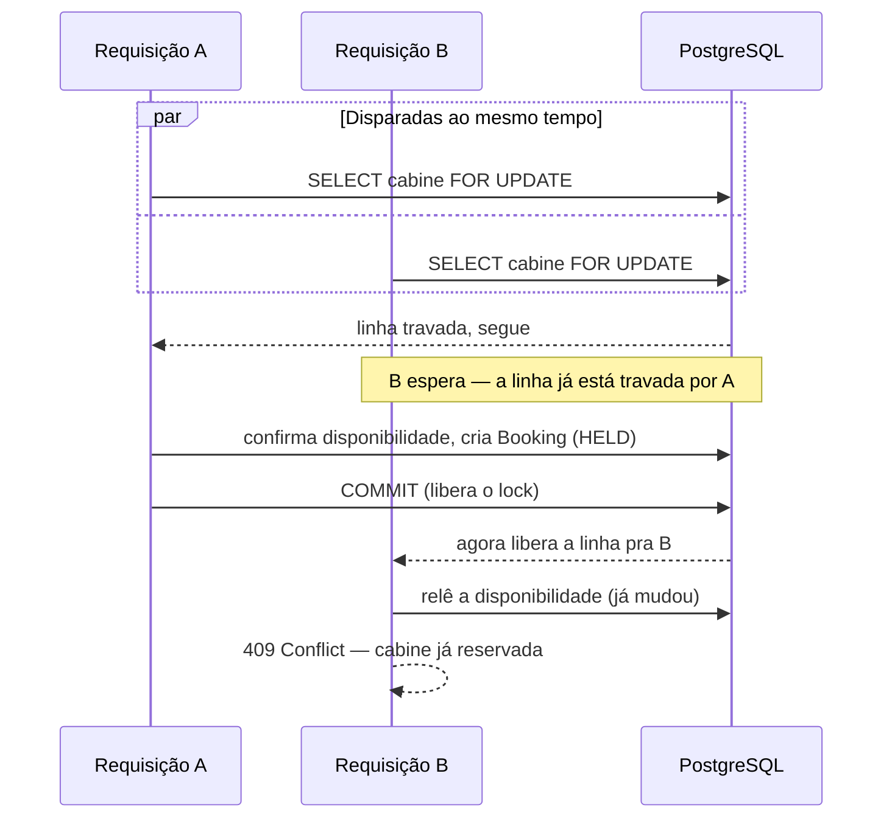
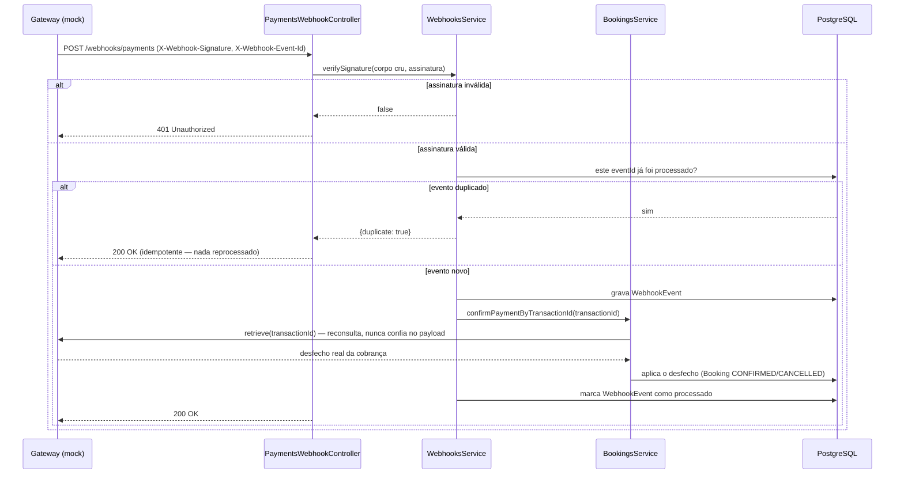
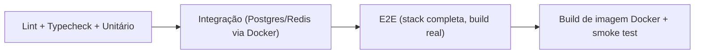

# SeaPass — Relatório Técnico Completo

> Relatório de apresentação do projeto SeaPass: plataforma de comercialização e gestão de
> cruzeiros temáticos, construída como teste técnico para vaga de desenvolvedor(a) pleno.
> Combina texto explicativo por seção com diagramas Mermaid (renderizam automaticamente no
> GitHub, VS Code, Notion, Obsidian). Última atualização: 10/09/2026.

**Números do projeto:** 36 modelos de dados · 20 enums · 20 ADRs de arquitetura · 483 testes
automatizados (302 unitários + 141 integração na API, 30 unitários + 10 E2E no frontend) · 5
route groups no frontend (visitante, autenticação, passageiro, organizador, admin) · 12+ módulos
de domínio no backend · em produção (Railway + Vercel).

---

## Índice

1. [Visão geral e proposta](#1-visão-geral-e-proposta)
2. [Personas e funcionalidades](#2-personas-e-funcionalidades)
3. [Arquitetura](#3-arquitetura)
4. [Stack tecnológica](#4-stack-tecnológica)
5. [Módulos do backend e suas dependências](#5-módulos-do-backend-e-suas-dependências)
6. [Modelagem de dados](#6-modelagem-de-dados)
7. [Fluxo de reserva e pagamento](#7-fluxo-de-reserva-e-pagamento)
8. [Concorrência e integridade](#8-concorrência-e-integridade)
9. [Segurança e autorização](#9-segurança-e-autorização)
10. [Eventos assíncronos, filas e o webhook de pagamento](#10-eventos-assíncronos-filas-e-o-webhook-de-pagamento)
11. [Testes e qualidade](#11-testes-e-qualidade)
12. [DevOps, CI/CD, observabilidade e produção](#12-devops-cicd-observabilidade-e-produção)
13. [Limitações conhecidas e próximos passos](#13-limitações-conhecidas-e-próximos-passos)
14. [Como rodar e avaliar](#14-como-rodar-e-avaliar)

---

## 1. Visão geral e proposta

SeaPass é um marketplace de dois lados. Produtoras independentes ("organizadores") publicam
cruzeiros temáticos — rock, heavy metal, techno, pagode, MPB — com navio, cabines, itinerário,
eventos e restaurantes próprios. Passageiros navegam o catálogo público, reservam uma cabine,
pagam, recebem um ingresso digital com QR Code e acompanham a viagem inteira num só lugar. Uma
plataforma administrativa audita e governa tudo, com isolamento entre organizadores garantido no
próprio backend — nunca por convenção de UI.

**O problema real que o projeto resolve:** comercializar um cruzeiro temático hoje é uma mistura
de planilha, WhatsApp e um checkout genérico que não entende "cabine", "hóspede" ou "embarque" —
o que produz overbooking resolvido manualmente, nenhuma visão de ocupação para o organizador, e
uma experiência fragmentada para o passageiro. SeaPass trata a cabine como unidade de estoque de
verdade (com o mesmo rigor de concorrência que um sistema de assentos de avião precisaria), preço
sempre recalculado no servidor, e um ingresso digital desde a emissão.

Três decisões resumem o projeto inteiro:

| Decisão | O que significa na prática |
|---|---|
| **Cabine como estoque real** | Motor de hold com lock de banco de verdade, não um campo `reservado: true` ingênuo — testado sob concorrência genuína (N requisições simultâneas, não sequenciais disfarçadas). |
| **Preço nunca confia no cliente** | Recalculado no servidor a cada checkout, a partir das tabelas de origem (preço da cabine, cupom, adicionais) — nunca de um valor já gravado que pode estar desatualizado. |
| **Isolamento por construção** | O filtro de organizador mora dentro da própria query do banco — nunca um filtro aplicado depois de já ter buscado o dado errado. |

---

## 2. Personas e funcionalidades

Cinco personas, cada uma com sua própria superfície do sistema:

- **Visitante** — catálogo público com busca/filtro (tema, destino, data, preço) e ordenação;
  detalhe do cruzeiro com itinerário, programação e avaliações de quem já viajou; mapa interativo
  do navio com disponibilidade de cabine em tempo real.
- **Passageiro** — fluxo de reserva completo (hold → hóspedes → adicionais/cupom → pagamento,
  com opção de parcelamento no cartão em até 12x, juros pela Tabela Price calculados só no
  servidor); ingresso digital com QR Code; reserva de eventos e restaurantes a bordo; "Minha
  Viagem" (timeline dia a dia com o próximo compromisso em destaque); avaliação da viagem (1–5
  estrelas) após o desembarque, moderada pelo organizador antes de virar pública; histórico de
  reembolsos da própria reserva.
- **Staff do organizador** — ferramenta de check-in por código: consulta o estado do ingresso,
  confirma o embarque, uso único garantido mesmo sob tentativas simultâneas.
- **Admin do organizador** — dashboard (receita, ocupação, ticket médio, top eventos/experiências);
  gestão de navio/cruzeiro/programação/preço; reservas e passageiros do próprio negócio; emissão
  de reembolso parcial ou total *(mockado)*, rastreável até esgotar o valor pago; moderação das
  avaliações recebidas (`PENDING → APPROVED/REJECTED → HIDDEN`); consulta de quais recursos beta
  estão liberados para o próprio negócio.
- **Admin da plataforma** — painel global com 14 áreas (usuários, organizadores, cruzeiros,
  navios, cabines, reservas, pagamentos, eventos, restaurantes, experiências, cupons, tickets,
  check-ins, feature flags) mais log de auditoria: aprova/suspende organizadores, cancela reserva
  ou cruzeiro inteiro em cascata, administra cupons de desconto, e libera funcionalidades em beta
  por organizador — catálogo de 13 flags fictícias (analytics avançado, marca personalizada,
  fidelidade, preço dinâmico, chat ao vivo, lista de espera de cabine, entre outras),
  nenhuma gateando uma feature real hoje: é a base reutilizável para um "beta controlado" futuro,
  não uma integração forçada.

---

## 3. Arquitetura

Monorepo (`pnpm` workspaces + Turborepo) com dois apps e três pacotes compartilhados:
`apps/api` (NestJS 10), `apps/web` (Next.js 15, App Router), `packages/contracts` (schemas Zod
compartilhados — o mesmo schema valida o backend e tipa o frontend), `packages/ui` (deliberadamente
vazio — nenhum componente foi extraído ainda, decisão documentada) e `packages/config` (ESLint/
Prettier compartilhados).

O backend é organizado em camadas **por domínio de negócio**, não por tipo técnico: cada módulo
separa `presentation/` (controllers, sem regra de negócio), `application/` (services, orquestram
o caso de uso), `domain/` (policies puras, sem I/O, 100% testáveis sem mock) e `persistence/`
(única camada que fala com o Prisma).



O grafo de módulos do backend é um **DAG verificado manualmente** — nenhuma dependência circular
(ver seção 5). `packages/contracts` é o contrato compartilhado: cada schema Zod é definido uma
vez e importado tanto pelo backend (`ZodValidationPipe` valida o corpo da requisição) quanto pelo
frontend (só o tipo TypeScript inferido, nunca revalidado no cliente — a validação de verdade é
sempre no servidor).

---

## 4. Stack tecnológica

| Camada | Tecnologia | Papel neste projeto |
|---|---|---|
| Backend | NestJS · Prisma · PostgreSQL | API REST, domínio de negócio, jobs assíncronos |
| Cache/fila | Redis · BullMQ | Hold de cabine, filas de notificação e emissão de ticket com retry |
| Frontend | Next.js 15 · React 19 · Tailwind 4 | Site público + 3 painéis autenticados (passageiro, organizador, admin) |
| Contrato | Zod (`packages/contracts`) | Um schema valida o backend e tipa o frontend |
| Auth | JWT (access) + refresh token rotativo (cookie `httpOnly`) | Sessão sem dependência de provedor externo |
| Testes | Jest (API) · Vitest (web) · Playwright (E2E) | Unitário, integração contra banco/Redis reais, E2E em browser real |
| Infra | Docker Compose · GitHub Actions | Ambiente local reprodutível, CI de 4 estágios |
| Logs | Pino | Logging estruturado com correlação de requisição (`req.id`) |

---

## 5. Módulos do backend e suas dependências

12 módulos de domínio, cada um em `apps/api/src/modules/<nome>/`, mais `notifications/`, `audit/`
e `health/` fora de `modules/` (infraestrutura transversal, não domínio de negócio). O grafo abaixo
reflete os imports reais entre módulos (`X --> Y` significa "X importa Y"):



*Módulos destacados (Catalog, Pricing, Reviews, Payments, FeatureFlags) não dependem de nenhum
outro módulo de domínio — são "folhas" do grafo, o que os torna os mais fáceis de testar e
entender isoladamente.* `Pricing` nem é um módulo Nest próprio: é lógica de domínio pura
(`PricingEngine`, `CouponPolicy`) importada diretamente por quem precisa, sem DI.

**Por que isso importa:** um DAG sem ciclos significa que qualquer módulo pode ser entendido lendo
só ele e o que está "abaixo" dele no grafo — nunca é preciso pular entre dois módulos que se
importam mutuamente para entender um dos dois.

---

## 6. Modelagem de dados

36 modelos Prisma, 20 enums, 17 migrações (cada uma nomeada e comentada com o "porquê", não só o
"o quê"). Dividido em dois diagramas para ficar legível: núcleo de **catálogo/inventário** (o que
o organizador cadastra) e núcleo de **reserva/pós-venda** (o que o passageiro gera).

### 6.1 Catálogo e inventário



**Duas decisões de modelagem deliberadas:** o preço de uma categoria de cabine é **por cruzeiro**
(`CruiseCabinPricing`), não por cabine física — a mesma cabine pode custar valores diferentes em
sailings diferentes; e `Cabin.status` é um estado operacional (`ACTIVE/MAINTENANCE/RETIRED`),
independente da disponibilidade *comercial* daquela cabine num cruzeiro específico (que é
calculada a partir de `Booking`, não armazenada).

### 6.2 Reserva e pós-venda



**Duas decisões de modelagem deliberadas:** `Booking.totalAmount` é uma coluna própria, congelada
no momento da reserva — nunca uma referência viva ao preço da categoria, que pode mudar depois; e
cancelamento é sempre soft-delete (`status` + `cancelledAt`, nunca `DELETE`) — auditoria e
relatório do organizador dependem do histórico sobreviver. `Payment.amount`, quando há
parcelamento (`installments > 1`), já inclui os juros calculados pela Tabela Price — o preço da
viagem em si (`Booking.totalAmount`) nunca muda por causa da forma de pagamento escolhida.

Fora dos dois diagramas (para não poluir a leitura): `AuditLog` (trilha append-only de toda ação
administrativa), `Notification` (registro de cada notificação gerada, com status de entrega
próprio), `RefreshToken`/`PasswordResetToken` (auth), `WebhookEvent` (dedup de eventos do webhook
de pagamento) e `Role`/`UserRole` (RBAC).

---

## 7. Fluxo de reserva e pagamento

Cada etapa é revalidada na seguinte — o servidor nunca confia em preço, disponibilidade ou dono
da reserva calculados numa etapa anterior.



**O detalhe que mais importa aqui:** a chamada ao `PaymentGateway` acontece **fora** de qualquer
transação de banco — nunca segurar o lock de uma linha durante uma chamada de rede que pode
demorar ou nunca voltar. Por isso `checkout` abre duas transações (`TX1`/`TX2`), uma antes e outra
depois da chamada ao gateway, exatamente como uma integração com um gateway real (Stripe, Mercado
Pago) precisaria fazer.

---

## 8. Concorrência e integridade

O mesmo princípio se repete em todo recurso com capacidade limitada — cabine, evento, horário de
restaurante: `SELECT ... FOR UPDATE` trava a linha do recurso disputado **antes** de somar quem já
reservou, dentro da mesma transação; um índice único parcial no banco é a segunda linha de defesa,
caso a lógica de aplicação falhasse.

Isso não é assumido — é **provado**: os testes de integração disparam N requisições genuinamente
simultâneas (`Promise.all` sem `await` entre os disparos) contra o mesmo recurso e confirmam que
exatamente uma vence.



**Idempotência:** um header `Idempotency-Key` opcional garante que um retry de rede no hold ou no
checkout nunca duplica uma reserva nem cobra duas vezes; o resultado da primeira tentativa é
sempre reproduzido, não recalculado.

---

## 9. Segurança e autorização

- **JWT com rotação de refresh token:** access token de 15 minutos vivendo só em memória no
  frontend (nunca `localStorage` — mitiga XSS), refresh token de 7 dias num cookie `httpOnly`.
  Cada uso do refresh token o invalida e emite um par novo; um token já usado sendo reapresentado
  é tratado como possível roubo e revoga todos os tokens do usuário (detecção de reuso). Em
  produção, frontend (Vercel) e API (Railway) são domínios diferentes — o cookie usa
  `sameSite: 'none'` (com `secure: true`, exigido por `None`) só nesse ambiente; em dev, onde
  front/back são same-site (mesma origem, portas diferentes), continua `'lax'`. Sem essa
  diferenciação, o refresh silencioso cross-site nunca era enviado pelo browser e a sessão caía
  sozinha ao voltar o foco na aba.
- **Regra consistente de posse de recurso — "404, nunca 403":** quando um recurso pertence a
  outro organizador (ou a outro passageiro), a resposta é sempre 404 — 403 confirmaria a
  existência do recurso a quem não deveria nem saber que ele existe. Verificado com mais de 30
  testes de integração dedicados a isolamento multi-tenant.
- **RBAC com mensagem útil:** quando o papel autenticado não tem permissão para a ação (ex.: uma
  conta de organizador tentando comprar uma passagem), o erro (`403`) explica que a conta logada
  não tem permissão para aquela ação — em vez do "Forbidden" genérico do framework.
- **SQL injection:** toda query parametrizada via Prisma — nenhuma concatenação de string,
  auditado manualmente.
- **Rate limiting:** piso global por IP, com limites bem mais apertados em rotas sensíveis
  (login, registro, recuperação de senha, o webhook de pagamento).
- **Logs redigidos:** `Authorization`/`Cookie` nunca gravados em texto puro, nem em produção.

---

## 10. Eventos assíncronos, filas e o webhook de pagamento

Duas camadas de evento, com propósitos deliberadamente diferentes: **eventos de domínio**
(`EventEmitter2`, síncronos, em processo) desacoplam quem causa algo de quem reage, sem forçar
fila; uma **fila de notificações** (BullMQ, com retry e dead-letter) cuida só do que é I/O de
rede de verdade — o envio de e-mail. Dez tipos de notificação cobertos hoje: confirmação de
reserva, aprovação/recusa/reembolso de pagamento, ingresso disponível, lembrete de embarque,
alteração de evento, cancelamento, e avaliação enviada/moderada.

O webhook de confirmação de pagamento (mockado — sem gateway real por trás) é o exemplo mais
completo de "nunca confiar no que chega de fora":



A assinatura é verificada com HMAC-SHA256 sobre o corpo **cru** da requisição (não o JSON já
reserializado) e comparada com `timingSafeEqual` — nunca uma comparação de string ingênua, que
vazaria quantos bytes bateram por análise de tempo de resposta.

**Reembolso rastreável** *(mockado)* segue exatamente o mesmo padrão de duas transações do
checkout: `SELECT ... FOR UPDATE` no pagamento antes de somar o que já foi devolvido, chamada ao
gateway fora da transação, aplicação do desfecho (`PARTIALLY_REFUNDED`/`REFUNDED`) numa segunda
transação. Múltiplos reembolsos parciais são permitidos até esgotar o valor pago, sempre isolado
por organizador (404, nunca 403, pra reembolso de fora do próprio negócio).

---

## 11. Testes e qualidade

| Camada | Quantidade | O que prova |
|---|---|---|
| Unitário (API) | 302 | Toda regra pura testada isolada; mock só na fronteira real de I/O |
| Integração (API) | 141 | Contra Postgres/Redis reais — concorrência, transação, isolamento multi-tenant |
| Unitário (web) | 30 | Lógica pura do frontend (timeline, layout do mapa do navio, formatação) |
| E2E (Playwright) | 10 | Browser real — reserva de ponta a ponta incluída |

Mock nunca substitui uma regra de negócio pura — só a fronteira real de I/O (repository, gateway
de pagamento, fila). Testes de concorrência disparam requisições verdadeiramente simultâneas, não
sequenciais disfarçadas de simultâneas.

---

## 12. DevOps, CI/CD, observabilidade e produção

Pipeline de CI (GitHub Actions) em 4 estágios encadeados:



O último estágio não confia em "buildou sem erro" — sobe o container de verdade e confere que
ele responde HTTP antes de considerar a imagem boa. Imagens de produção são multi-stage,
não-root, com `HEALTHCHECK`. Observabilidade desta fase: logging estruturado (Pino) com `req.id`
correlacionando cada requisição, e `GET /health` agregando o status real de Postgres e Redis.
Métricas e tracing (Prometheus/OpenTelemetry) ficam documentados como próximo passo, não como algo
parcialmente implementado.

**Em produção:** API + Postgres + Redis na Railway, frontend na Vercel — deploy automático a cada
`push` na `main`. Duas armadilhas reais de empacotamento resolvidas no `Dockerfile` multi-stage
(`infra/docker/api.Dockerfile`): `pnpm deploy --prod` roda o `prisma generate` do próprio
`postinstall` durante o empacotamento, mas o Client gerado não sobrevive na pasta final —
corrigido gerando de novo, explicitamente, depois do `deploy` já ter empacotado tudo; e o Alpine
da imagem base não vem com OpenSSL, fazendo o Prisma "chutar" a versão de libssl do query engine
(`apk add --no-cache openssl` no estágio base). Migrations rodam sozinhas (`prisma migrate
deploy`) a cada boot do container, antes do servidor subir — nunca dependem de um passo manual
pós-deploy.

---

## 13. Limitações conhecidas e próximos passos

Escopo deliberadamente fora desta entrega — decidido, não esquecido: gateway de pagamento real
(a interface `PaymentGateway` já está pronta para receber uma implementação real sem tocar no
domínio), upload de imagem (a infraestrutura S3-compatible provisionada no início foi removida
por não ter nenhum consumidor real), leitura de QR Code por câmera, painel de métricas.

Duas decisões de refatoração foram consideradas e conscientemente adiadas, com o raciocínio
documentado: um componente genérico de tabela para o painel admin (a duplicação existe, mas cada
página difere o bastante em colunas/ações que a abstração exigiria bastante indireção sem um
terceiro caso idêntico real); e separar o service de dashboard analítico do organizador do CRUD de
tenant (os dois compartilham utilitários, e a mistura de responsabilidades ainda não atrapalha o
suficiente para justificar a divisão agora).

---

## 14. Como rodar e avaliar

**Direto no navegador, sem instalar nada:** https://viber-test-september-2026-web.vercel.app (API
em `https://seapass-seapass-env.up.railway.app`).

Ou tudo abaixo, localmente, com Docker + pnpm — nenhuma conta externa nem chave de API necessária.

```bash
docker compose -f infra/docker-compose.yml up -d
pnpm install
pnpm db:migrate
pnpm db:seed
pnpm dev   # web em :3000, API em :3333
```

**Login de demonstração** (senha `Seapass@123` para todos):
`passageiro1@example.com` · `organizador@rockinsea.com` · `admin@seapass.com`.

**Testes:** `pnpm test` (unitário) · `pnpm test:integration` · `pnpm test:e2e` — os três com
infraestrutura real, nunca mockada.

**Leitura complementar:** `README.md` (visão completa) · `docs/architecture/decisions/` (20 ADRs)
· `docs/INTERVIEW_QA.md` (50 perguntas técnicas respondidas) · `docs/DEVLOG.md` (histórico
cronológico de decisões).
